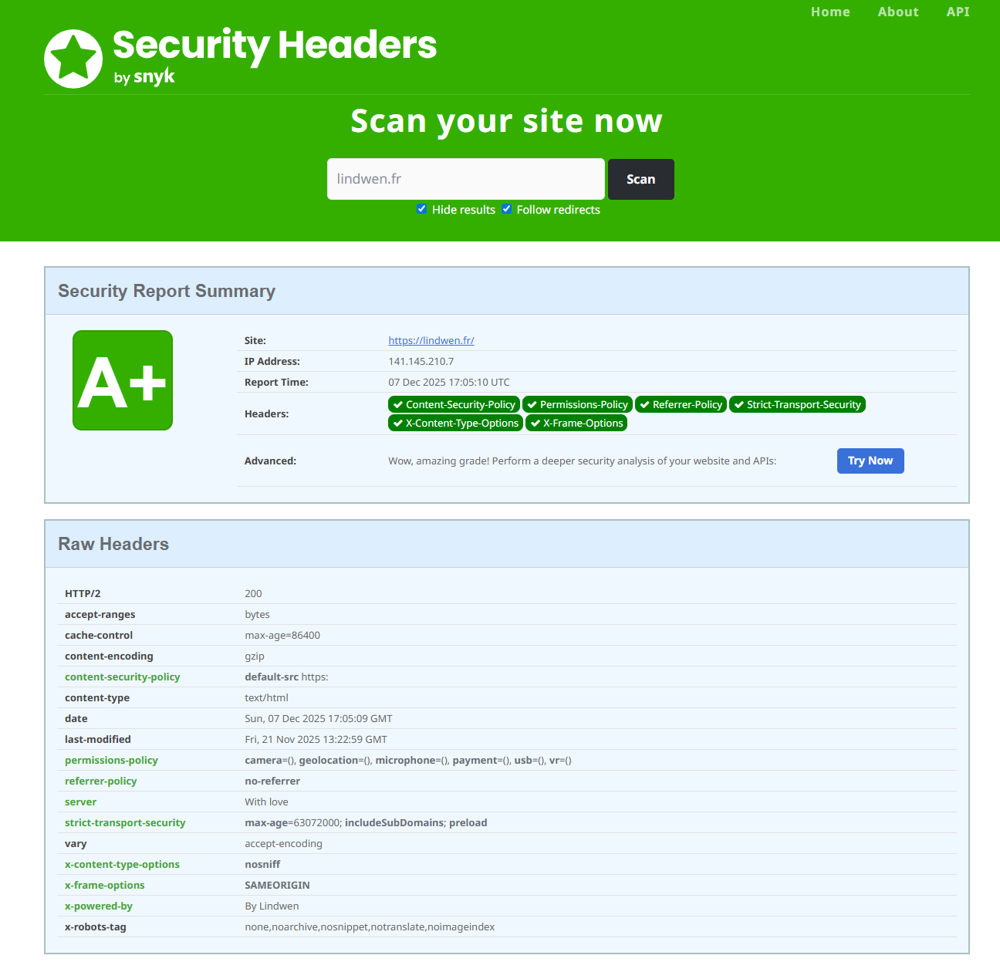
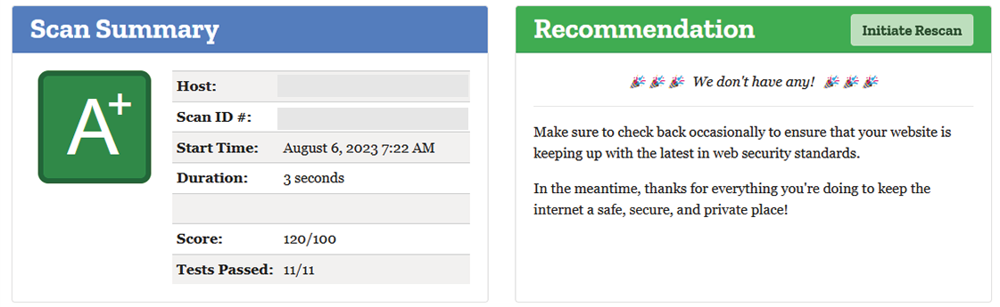

# traefik-docker-compose

Streamline microservices deployment with Traefik and Docker Compose.
And secure your website with security headers.

* Score on : [securityheaders.com](https://securityheaders.com/)


* Score on : [observatory.mozilla.org](https://observatory.mozilla.org/)


## Traefik

Traefik is a modern HTTP reverse proxy and load balancer that makes deploying microservices easy. Traefik integrates with your existing infrastructure components and configures itself automatically and dynamically.

## Docker Compose

Docker Compose is a tool for defining and running multi-container Docker applications. With Compose, you use a YAML file to configure your application's services.

## Usage

### Prerequisites

Make sure you have the following installed:

- [Docker](https://docs.docker.com/get-docker/)
- [Docker Compose](https://docs.docker.com/compose/install/)

### Configuration

1. Clone the repository and navigate to it:

```bash
git clone https://github.com/Lindwen/traefik-docker-compose.git
cd traefik-docker-compose
```

2. Create a data directory for the web service and an `index.html` file and create acme.json file for traefik:

```bash
mkdir data
echo "Hello World" > data/index.html
touch acme.json
chmod 600 acme.json
```

3. Configure the `traefik.toml` file by changing the email address:

```toml
# Change the email address
[certificatesResolvers.letsencrypt.acme]
  email = "YOUR_EMAIL_ADDRESS"
```

4. Configure the `docker-compose.yml` file by modifying the domain name for Traefik and the web service, and add authentication for the Traefik dashboard if needed:

```yml
# Change the domain name for the traefik and web service
- "traefik.http.routers.<service>.rule=Host(`YOUR_DOMAIN_NAME`)"
# Add auth for Traefik dashboard if needed
- "traefik.http.routers.dashboard.middlewares=auth"
- "traefik.http.middlewares.auth.basicauth.users=<username>:<password>"
```

5. Check the middleware in the `configuration/security-headers.toml` file:

```toml
# This middleware is very restrictive. You may need to customize it according to your needs, but it's a good starting point to secure your website and the Traefik dashboard.
contentSecurityPolicy = "default-src 'none'; script-src 'self' https://traefik.github.io; connect-src 'self'; img-src 'self' data:; style-src 'self'; font-src 'self'; object-src 'none'; frame-ancestors 'none'; form-action 'none'; base-uri 'none';"
```

6. ⚠️ WARNING: the `mintls12@file` block ssl activation by letsencrypt.
If you want to use ssl, you need to comment this line in docker-compose.yml and uncomment after the first start of the containers.

```toml
# - "traefik.http.routers.website.tls.options=mintls12@file"
```

### Start

To start the containers:

```bash
docker compose up -d
```

### Stop

To stop the containers:

```bash
docker compose down
```

### Logs

To view live logs:

```bash
docker compose logs -f
```

## Need Help?

If you encounter any issues, need help, or have questions, please don't hesitate to reach out. You can create an [issue](https://github.com/Lindwen/traefik-docker-compose/issues/new) here on GitHub. We're here to assist you and improve this project based on your feedback.

### How to Create an Issue

1. Click on the "Issues" tab at the top of this repository.
2. Click the green "New Issue" button.
3. Provide a descriptive title and detailed description of the problem you're facing or the help you need.
4. Submit the issue, and we'll get back to you as soon as possible.

Your feedback is valuable, and we appreciate your contributions to making this project better.

---

### Thanks

* [PaulsBlog](https://www.paulsblog.dev/harden-your-website-with-traefik-and-security-headers/) - for the security headers