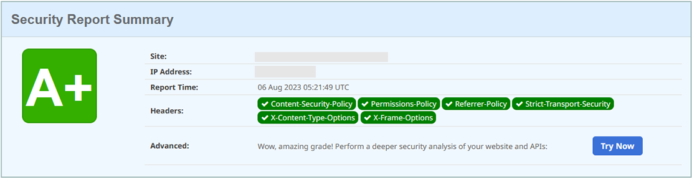

# traefik-docker-compose

Ce repository contient ma configuration de Traefik pour mon serveur.
Vous pouvez aussi l'utiliser pour votre serveur.

## Utilisation

1. Cloner le repository

```bash
# HTTPS
git clone https://github.com/Lindwen/traefik-docker-compose.git
# SSH
git clone git@github.com:Lindwen/traefik-docker-compose.git

cd traefik-docker-compose
```

2. Créer un fichier `.env`

```bash
cp .env.example .env
vi .env
```

```env
DOMAIN=proxy.domain.tld
USERNAME=admin
PASSWORD=
```

- `DOMAIN` : le domaine de votre proxy
- `USERNAME` : le nom d'utilisateur de votre dashboard
- `PASSWORD` : le mot de passe de votre dashboard (généré avec htpasswd et double $)

3. Créer un fichier `acme.json`

```bash
touch acme.json
chmod 600 acme.json
```

4. Créer le réseau proxy-net

```bash
docker network create proxy-net
```

5. Lancer le docker compose

```bash
docker compose up -d && docker compose logs -f
```

6. Accéder à votre dashboard sur `https://proxy.domain.tld`

7. Ajouter un service à Traefik

```yaml
services:
  whoami:
    image: traefik/whoami:latest
    container_name: whoami
    restart: unless-stopped
    labels:
      # --- Traefik ---
      - "traefik.enable=true"
      - "traefik.http.routers.whoami.rule=Host(`whoami.domain.tld`)"
      - "traefik.http.routers.whoami.service=whoami"
      # Si vous utilisez un port autre que 80, vous devez le spécifier
      # - "traefik.http.services.whoami.loadbalancer.server.port=8080"
      - "traefik.http.routers.whoami.entrypoints=websecure"
    networks:
      - proxy-net

networks:
  proxy-net:
    external: true
```

## Explications et modifications possibles

### Pourquoi utiliser le plugin AddMissingHeaders ?

Le plugin AddMissingHeaders est un plugin qui ajoute les headers manquants à la réponse HTTP.
Au contraire de traefik qui écrase les headers par défaut, le plugin AddMissingHeaders ajoute les headers manquants.
Ce qui me permet d'avoir un score de A+ sur https://securityheaders.com/.



### Utilisez un DNS Challenge au lieu d'un HTTP Challenge

Il faut modifier le fichier `traefik.yml` et remplacer le bloc suivant :
(Ici j'utilise Scaleway pour le DNS Challenge)

```diff
certificatesResolvers:
  letsencrypt:
    acme:
      storage: acme.json
      caServer: https://acme-v02.api.letsencrypt.org/directory
-     httpChallenge:
-       entryPoint: web
+     dnsChallenge:
+       provider: scaleway
+       delayBeforeCheck: "0s"
```

Il faut aussi ajouter deux variables d'environnement dans le fichier `.env` et le docker compose :

```diff
+ SCW_ACCESS_KEY=
+ SCW_SECRET_KEY=
```

```diff
environment:
+   - SCW_ACCESS_KEY=${SCW_ACCESS_KEY}
+   - SCW_SECRET_KEY=${SCW_SECRET_KEY}
```
